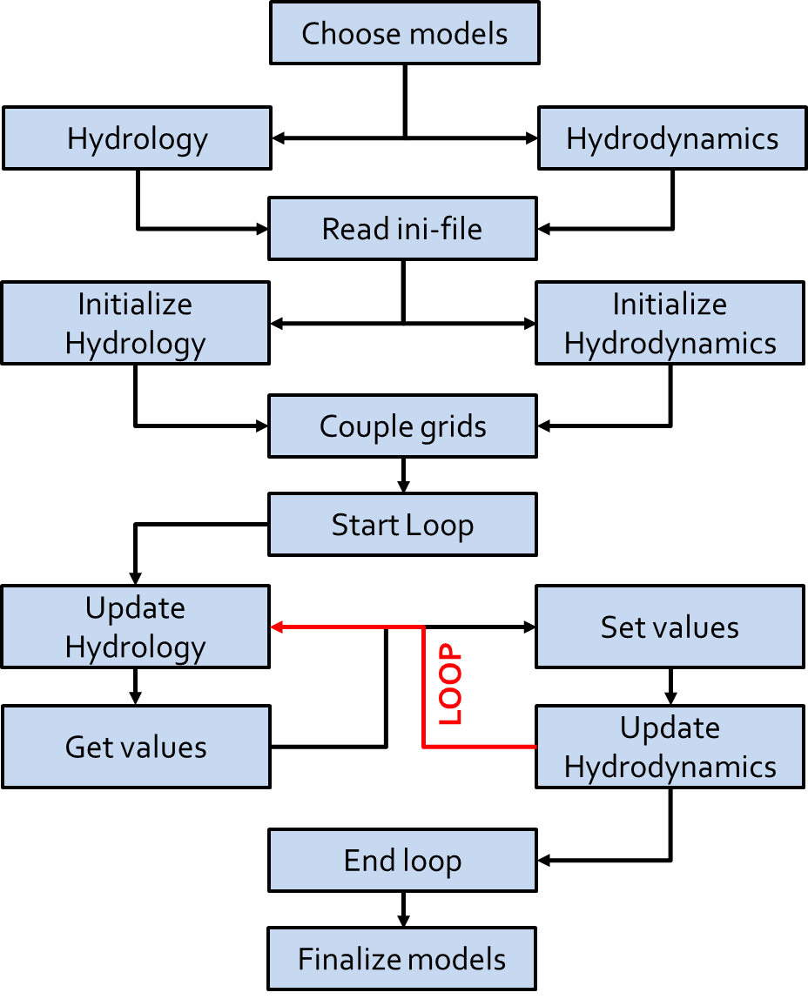

.. _basicModelInterface:

*******************************
The BMI
*******************************

Introduction
============

The technical key concept behind GLOFRIM is the Basic Model Interface (`BMI <https://csdms.colorado.edu/wiki/BMI_Description>`_).

It was first introduced by [Peckham2013]_ and constitues the main technical infrastructure for the Community Surface Dynamics
Modeling System (`CSDMS <https://csdms.colorado.edu>`_).

Once a model is bmi'ed, an ensemble of functions is available to retrieve or change information about model properties, 
variables, time, and many more. See :ref:`codeDocumentation` for a full overview of BMI and GLOFRIM functions.

The most central functions are shown in the following table.

.. table:: *Main functions of the Basic Model Interface.*

    +------------------------+------------------------+------------------------+
    | bmi.initialize()       | initializes the model                           |
    +------------------------+------------------------+------------------------+
    | bmi.get_value()        | retrieves value of a model variable from memory |
    +------------------------+------------------------+------------------------+
    | bmi.set_value()        | overwrites value of a model variable on memory  |
    +------------------------+------------------------+------------------------+
    | bmi.update()           | updates model states a number of timesteps      |
    +------------------------+------------------------+------------------------+
    | bmi.finalize()         | finalizes model processes                       |
    +------------------------+------------------------+------------------------+

A BMI is language-independent; that is, the programming language of the model is no restriction.
For instance, LFP is written in C++, PCR and WFL in Python, and CMF as well DFM in Fortran.

To establish a Python-based coupling framework, however, an additional `BMI Wrapper <https://github.com/openearth/bmi-python>`_ 
is needed to "translate" the model-specific BMI functions into Python-compatible information.

Why the BMI?
------------
Compared to other model coupling techniques (such as internal or external coupling), using the BMI allows for creating 
a flexible coupling framework where models can be continiously be developed without affecting the coupling. This is because 
the BMI is **non-invasive**, i.e. no changes to the code have to be made.

Since models do only interact via the interfaces, unnecessary entanglement of model code is avoided (as it is by internal coupling).
Besides, models are  executed simultaneously which is the basis for further extension of model coupling (as it is by
external coupling) and any dynamic coupling between states/fluxes of different mdoels can be set up flexibly, depending
on study purpose.

Also, all 'bmi'ed' models can still be executed in stand-alone mode.

Compared to 'non-bmi'ed' version of a model, run times of the 'bmi'ed' version are near-identical.

GLOFRIM workflow
================
By applyting the BMI functions, the following workflow is followed in GLOFRIM. The example shows coupling between a
hydrologic and a hydrodynamic model, but would be identical if other or more models were coupled.

After the model are chosen and coupling settings are defined in the GLOFRIM ini-file, the ini-file is read by GLOFRIM
to first initialize the model-specific configuration files and then initialize both models as a coupled entity.

Essential part of creating the coupled entity is the coupling of grids which is explained in more detail in :ref:`gridCoupling`.

Once the coupled models are initialized, a loop is entered, starting at the start time and terminating at the end time
as specified in the python executiont command (see :ref:`run_from_commandline`).

During the loop, models are individually updated from the upstream end of the model cascade to the most downstream model,
depending on the number of models coupled.

After a model is updated, the variables to be exchanged (as defined in GLOFRIM ini-file) are retrieved from the providing model,
if necessary aligned, and inserted to the receiving model. Only then, model time of the receiving model is forward integrated
until the model time of the providing model is reached.

If model end time is reached, model execution is finalized.

