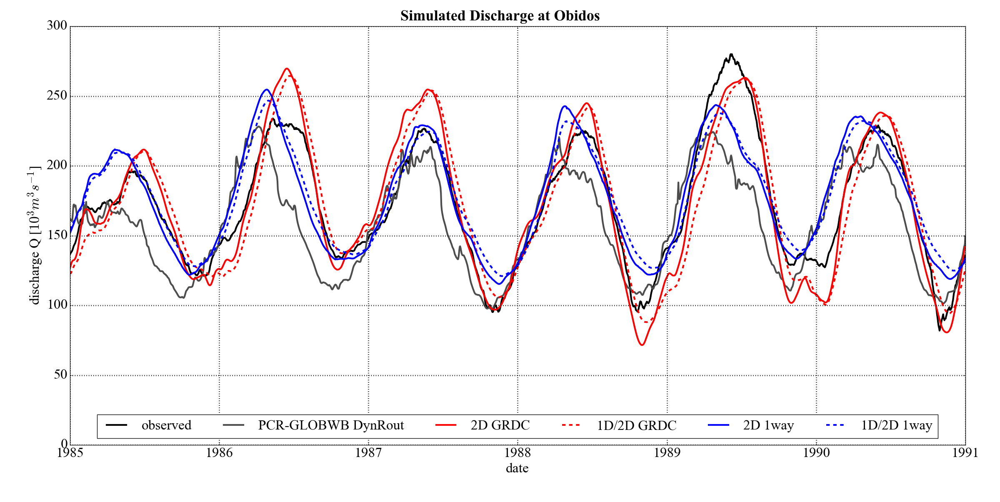
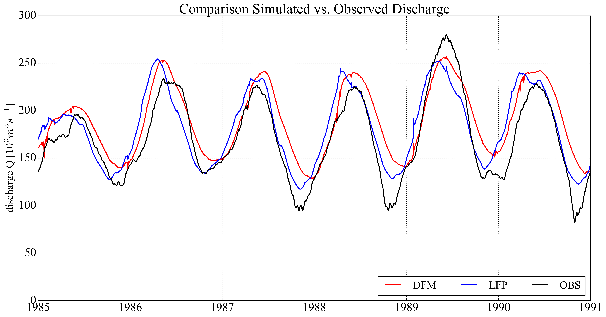

.. _applications:

***************
Applications
***************

GLOFRIM 2.0 publication
=======================

Accompanying the official launch of version 2.0 of GLOFRIM, a paper was published in NHESS [Hoch2019]_.

In this paper, we showcase the different model coupling combinations and apply them for two case studies. The objective of this study was to evaluate
to what extent varying model complexity may influence the accuracy of simulated flood wave propagation and flood extent.

First, we coupled PCR with CMF in the Amazon River basin. Results indicate that replacing the kinematic wave approximation with the local inertia equations improves
in particular the timing of the flood peaks. This can become very relevant for early-warning applications.

Second, we coupled PCR with CMF as well as coupled PCR with CMF with LFP in the Ganges-Brahmaputra basin. In contrast to the Amazon case, discharge results did not improve by
coupling PCR to CMF. Instead, they deteriorated. We assume that this response relates to the role of runoff in the coupling scheme. While the timing and magnitude of volume
seems accurate in the Amazon, it is out of sync in the Ganges-Brahmaputra basin. Only if runoff simulated by hydrologic models is quality-checked, model coupling can 
make full use of its potential. When adding in LFP, discharge results did not change much, but accuracy of simulated flood extent improved greatly. This is most likely to the
explicit simulation of channel-floodplain interaction in LFP as well as the better representation of smaller channels in the study area.

In a nutshell, the study showed that a) model coupling cannot make up for inaccuracies in model forcing and b) that the complexity of a flood model determines the quality of 
model output, yet this very much depends which output variable is considered. Not for all variables, the "most complex" model may be required.

Past Applications
====================

The previous version, GLOFRIM 1.0, was successfully applied for replacing the routing scheme of PCR [Hoch2017a]_, for benchmarking the
hydrodynamic models DFM and LFP [Hoch2017b]_, and for benchmarking different schematizations of DFM [Hoch2018]_.

Results of a test case in the Amazon River basin show that by applying the full shallow water equations instead of the kinematic wave approximation 
increases the accuracy of simulated discharge:

Benchmarking the hydrodynamic models revealed similar performace with respect to simulated discharge:

.. todo::
    align layout of figures

However, simulated flood extent differs locally due to the different gridding schemes applied, yielding a low critical success index *C*:

+------------------------+------------------------+------------------------+
| Hit rate               | False alarm ration     | Critical Succes Index  |
+========================+========================+========================+
| 0.85                   | 0.50                   | 0.46                   |
+------------------------+------------------------+------------------------+

Current developments and future applications
============================================

We are planning to some more crazy stuff with GLOFRIM.

These include amongst others:

* Coupling PCR with CMF at a global scale,
* Further benchmarking of hydrologic and hydrodynamic models,
* Linking GLOFRIM with other (non-)pysical models such as meteorological models or agent-based models,
* Using nested models for compound flood modelling.

Stay tuned!

