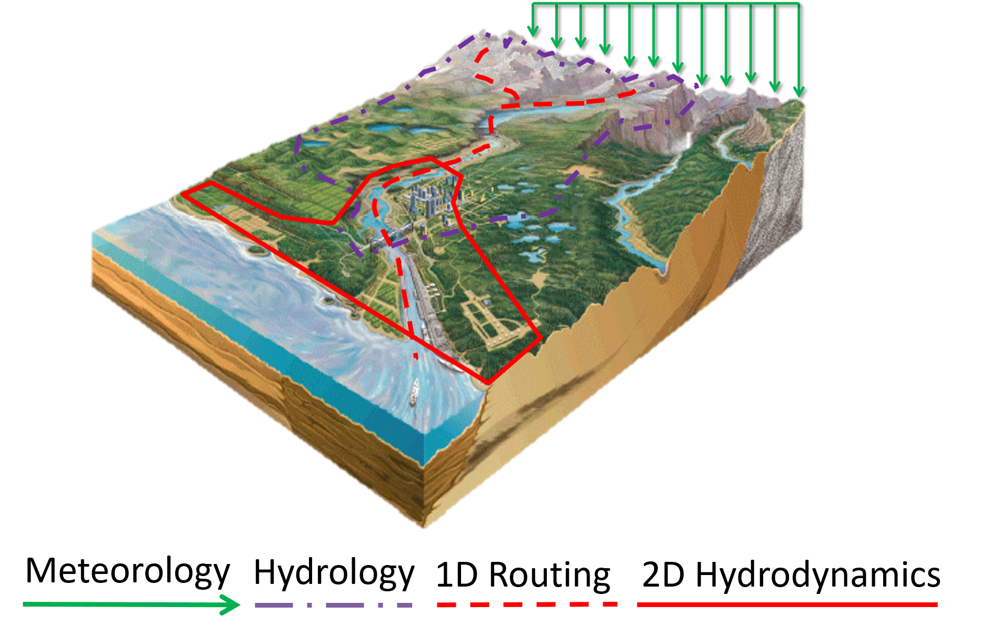

.. GLOFRIM documentation master file, created by
   sphinx-quickstart on Wed Aug 08 14:02:04 2018.
   You can adapt this file completely to your liking, but it should at least
   contain the root `toctree` directive.

*******************************
GLOFRIM
*******************************

Main development by Jannis M. Hoch (Utrecht University, Deltares), Dirk Eilander (VU Amsterdam, Deltares), Hiroaki Ikeuchi (University of Tokyo), Hessel Winsemius (Deltares) and Fedor Baart (Deltares).

Contact: Jannis M. Hoch (j.m.hoch@uu.nl), Dirk Eilander (dirk.eilander@vu.nl)

We also want to acknowledge the contributions of all colleagues involved in the development of GLOFRIM.

.. image:: https://zenodo.org/badge/90723537.svg
   :target: https://zenodo.org/badge/latestdoi/90723537

.. image:: https://readthedocs.org/projects/glofrim/badge/?version=latest
   :target: https://glofrim.readthedocs.io/en/latest/?badge=latest
   :alt: Documentation Status

.. image:: https://img.shields.io/badge/License-GPLv3-blue.svg
   :target: https://www.gnu.org/licenses/gpl-3.0

Description
================

GLOFRIM offers a flexible and modular tool to couple hydrologic, routing, and hydodynamic models across scales. This enables integration of physical processes from different models. The coupling process is spatially explicit (i.e. on grid-to-grid basis) and model information is exchanged online (i.e. per time step).

GLOFRIM is designed as a “human interface” with additional and user friendly Python functions on top of the basic model interface (BMI), which makes it easy to setup and run coupled model simulations. For the model developer, only the BMI needs to be implemented in the model in a scripting language of choice, which makes it easy to develop and maintain. 

With the available models, different coupled hydrologic and hydrodynamic model runs can be done, for instance:

* 2-step coupling: hydrology -> 1D routing or hydrology -> full 2D hydrodynamics
* 3-step coupling: hydrology -> 1D routing -> full 2D hydrodynamics

GLOFRIM download
================

The current stable release is GLOFRIM 2.0 and downloadable from `Zenodo <https://doi.org/10.5281/zenodo.3364388>`_. 
Version 2.0 was used in the description artile published in `NHESS <https://www.nat-hazards-earth-syst-sci.net/19/1723/2019/nhess-19-1723-2019.html>`_.

GLOFRIM is hosted on `GitHub <https://github.com/openearth/glofrim>`_. All unreleased developments can be found there.

All GLOFRIM code is licensed under the GNU General Public License v3.0.

Acknowledgments
===============

The development of GLOFRIM was only possible due to the contribution of many colleagues at various departments and universities.

Particular shout-outs go to:

Jeffrey Neal, Paul Bates, Arthur van Dam, Herman Kernkamp, Edwin Sutanudjaja, Rens van Beek, and Marc Bierkens.

Research was funded by the European Institute of Innovation and Technology (EIT) Climate-KIC and Netherlands Organisation for Scientific Research (NWO).

Structure
=========================
.. toctree::
   :numbered:
   :maxdepth: 2

   intro.rst
   models.rst
   gridCoupling.rst
   BMI.rst
   requirements.rst
   running_GLOFRIM.rst
   references.rst  
   codeDocumentation.rst

Indices and tables
==================

* :ref:`genindex`
* :ref:`modindex`
* :ref:`search`

