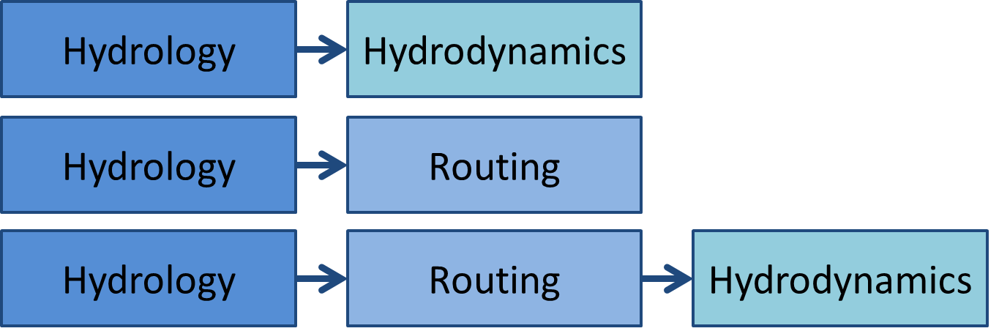

.. _intro:

*******************
Introducing GLOFRIM
*******************

Welcome at the documentation page of GLOFRIM, a globally applicable framework for integrated hydrologic-hydrodynamic modelling.

With GLOFRIM it is possible to couple models *spatially explicit* (that is, on a grid-to-grid basis) and *online* (that is, on a timestep basis).

Currently, two different coupling strategies can be realized with GLOFRIM, either two-model coupling or three-model coupling.
The former allows to couple hydrology to either routing or hydrodynamic model, while the latter represents the full modelling cascade hydrology to routing to hydrodynamics.

Depending on modelling requirements of a study, the coupled models can be configured to your liking. After all, not every physical process and the highest level of detail are required to answer
a research question. As such, GLOFRIM can be a flexible tool to avoid under- and overfitting of the modelling question.

Furthermore, the fact that GLOFRIM makes use of the BMI technology allows for extending the current modelling cascade with additional (non-)physical models, ever increasing the
representation of relevant processes in a consistent manner.

Supported models
================
The models currently supported by GLOFRIM are:

Hydrologic models:
------------------
* *PCR-GLOBWB*: Global water balance model developed at Utrecht University [Sutanudjaja2018]_ running at 30 or 05 arc-min spatial resolution; water balance computed based on meteorological forcing, humand and industrial water demand and abstractions; solves kinematic wave approximation for discharge simulations
* *WFLOW*: modelling suite for distributed hydrological models within the Deltares OpenStreams project [WFLOW_docs]_; contains various hydrologic models, amongst others SBM and HBV; runs on a regular grid but grid resolution is variable; also solves kinematic wave approximation for discharge simulations

Routing models:
---------------
* *CaMa-Flood*: Global routing models designed for fast flood wave propagation simulations; consists of 1D channels plus water balance simulations for floodplains; basin delineation as unit catchments; developed by the University of Tokyo [Yamazaki2011]_

Hydrodynamic models:
--------------------
* *Delft 3D Flexible Mesh*: solving the full shallow water equations; model discretizations can be either flexible meshes, unstructured grids or regular grids; supports 1D, 2D, 1D-2D, and 3D modelling; developed by Deltares [Kernkamp2011]_
* *LISFLOOD-FP*: specifically designed for inundation modelling; solving the local inertia equations; allows for 1D, 2D or sub-grid channel discretizations; model grid is always regular; developed by University of Bristol, School of Geographical Studies [Bates2010]_

A slighly more elaborated description of the models can be found in the next chapter.

Possible applications of GLOFRIM
================================

GLOFRIM is a modular tool allowing for a flexible combinations of different hydrologic and hydrodynamic models.
Depending on the design of the coupled model, GLOFRIM can be used for applications such as:

#. *Benchmarking of hydrodynamic models*: By providing identical spatially varying and explicit hydrologic forcing, the performance of hydrodynamic models can be compared
#. *Nested modelling*: By adding detailed 2D hydrodynamics to large-scale hydrology and routing, inundations can locally be simulated with more accuracy
#. *Large-scale routing*: For large-scale discharge simulations, replacing kinematic wave approximations with routing models increased accuracy while not increasing run time unneccesarily

GLOFRIM was so far applied and documented in [Hoch2017a]_, [Hoch2017b]_ and [Hoch2019]_. Brief summaries can be found in 
:ref:`applications`.
